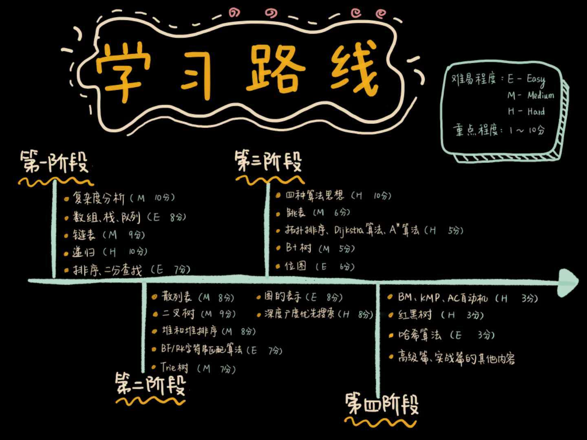

# Data Structure and Algorithm

## 学习路线



## 复杂度分析


## 数组、栈、队列和链表

### 数组

数组（Array）是一种`线性表`数据结构。它用一组连续的内存空间，来存储一组具有相同类型的数据。

`线性表`（Linear List）就是数据排成像一条线一样的结构。每个线性表上的数据最多只有两个方向。除了数组，`链表`、`队列`、`栈`也是线性表结构。


### 栈

栈的特性：后进先出

### 队列

队列是一种先进先出（First in First Out）的线性表，简称FIFO。允许插入的一端称为队尾，允许删除的一端称为队头。假设队列是q=（a1,a2,…,an），那么a1就是队头元素，而an是队尾元素。这样我们就可以删除时，总是从a1开始，而插入时，列在最后。这也比较符合我们通常生活中的习惯，排在第一个的优先出列，最后来的当然在队伍的最后。

队列也有类似线性表的各种操作，不同的就是插入数据只能在队尾进行，删除数据只能在队头进行。

Python实现队列：
```python
#!pypthon3
```