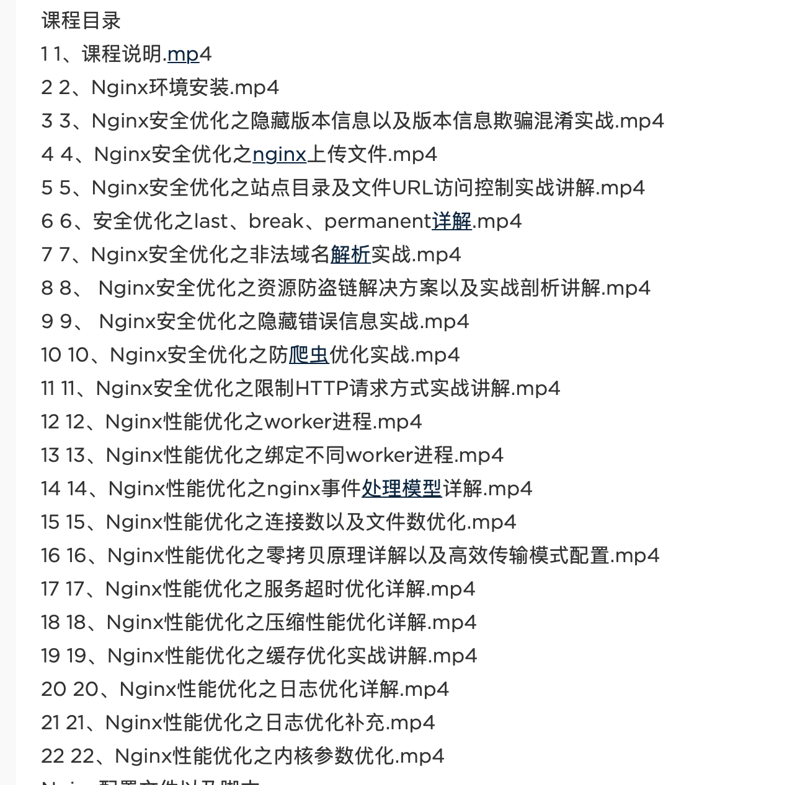
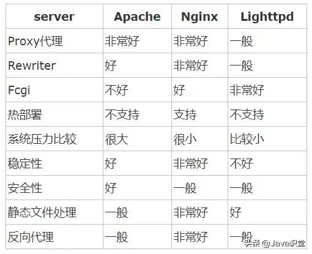

## 基础配置

## 反向代理

## 负载均衡

负载均衡调度方法：

1. weight轮询(默认)：接收到的请求按照顺序逐一分配到不同的后端服务器，即使在使用过程中，某一台后端服务器宕机，Nginx会自动将该服务器剔除出队列，请求受理情况不会受到任何影响。 这种方式下，可以给不同的后端服务器设置一个权重值(weight)，用于调整不同的服务器上请求的分配率；权重数据越大，被分配到请求的几率越大；该权重值，主要是针对实际工作环境中不同的后端服务器硬件配置进行调整的。

2. ip_hash：每个请求按照发起客户端的ip的hash结果进行匹配，这样的算法下一个固定ip地址的客户端总会访问到同一个后端服务器，这也在一定程度上解决了集群部署环境下session共享的问题。

3. fair：智能调整调度算法，动态的根据后端服务器的请求处理到响应的时间进行均衡分配，响应时间短处理效率高的服务器分配到请求的概率高，响应时间长处理效率低的服务器分配到的请求少；结合了前两者的优点的一种调度算法。但是需要注意的是Nginx默认不支持fair算法，如果要使用这种调度算法，请安装upstream_fair模块。

4. url_hash：按照访问的url的hash结果分配请求，每个请求的url会指向后端固定的某个服务器，可以在Nginx作为静态服务器的情况下提高缓存效率。同样要注意Nginx默认不支持这种调度算法，要使用的话需要安装Nginx的hash软件包。

## 关于安全配置

下图是安全方面的学习内容：

## Web Server 对比

名词解释：
- 热部署： 当应用正在运行时，升级/修改软件就不需要重启应用。
- FCGI： fast-CGI。CGI是公共网关接口（Common Gateway Interface）

## Questions

1. 什么是反向代理？

    客户端本来可以直接通过HTTP协议访问某网站应用服务器，网站管理员可以在中间加上一个Nginx，客户端请求Nginx，Nginx请求应用服务器，然后将结果返回给客户端，此时Nginx就是反向代理服务器。

    正向代理：

2. Nginx 在安全方面有什么作用？

3. 为什么使用代理服务器？

- 提高访问速度
- 防火墙作用

    由于所有的客户机请求都必须通过代理服务器访问远程站点，因此可以在代理服务器上设限，过滤掉某些不安全信息。同时正向代理中上网者可以隐藏自己的IP,免受攻击。

- 突破访问限制
- 正向代理
    代理客户端，服务端不知道实际发起请求的客户端，常用作VPN之类的应用。

- 反向代理

    代理服务端，客户端不知道实际提供服务的服务器。（像代购，用户只需要商品，不需要关心商品的来源）

